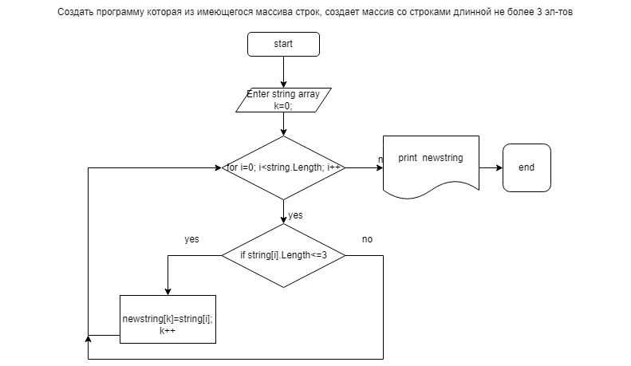

## Задача

Написать программу, которая из имеющегося массива строк формирует массив из строк, длинна которых меньше либо равна 3символа.

## Решение

В заданном массиве строк проверяем длинну каждого элемента. Если условие задачи выполнено проверяемый элемент массива записывается в новый массив. Если не выполняется проверяем следующий элемент.

# Алгоритм

